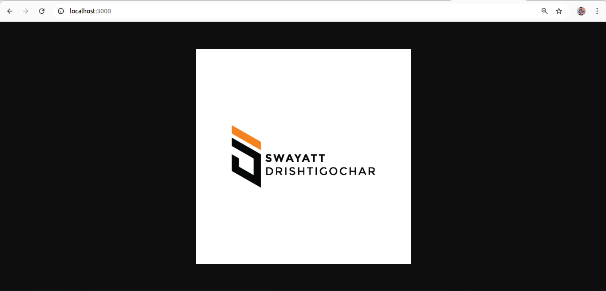

#🚀 DevOps Task Submission

This project demonstrates a CI/CD pipeline using Jenkins, Docker, docker-hub, and AWS ECR for a sample Node.js application.

#📁 Project Structure
devops-task/
├── app.js
├── package.json
├── Dockerfile
├── Jenkinsfile
├── README.md
├── deployment-proof/   # Add screenshots or public URL
└── docs/
    └── architecture.png (Optional: Architecture Diagram)

## Output

#jenkins  cicd pipeline

#🔧 Setup Instructions
1. Clone the Repository
git clone git@github.com:MaheshBabu-DevOps/devops-task.git
cd devops-task

git checkout -b dev
git push origin dev

#2. Jenkins Installation on Ubuntu
sudo wget -O /etc/apt/keyrings/jenkins-keyring.asc \
  https://pkg.jenkins.io/debian-stable/jenkins.io-2023.key
echo "deb [signed-by=/etc/apt/keyrings/jenkins-keyring.asc]" \
  https://pkg.jenkins.io/debian-stable binary/ | sudo tee \
  /etc/apt/sources.list.d/jenkins.list > /dev/null
sudo apt-get update
sudo apt-get install jenkins

sudo apt update
sudo apt install fontconfig openjdk-21-jre
java -version
openjdk version "21.0.3" 2024-04-16
OpenJDK Runtime Environment (build 21.0.3+11-Debian-2)
OpenJDK 64-Bit Server VM (build 21.0.3+11-Debian-2, mixed mode, sharing)

sudo systemctl enable jenkins
sudo systemctl start jenkins
sudo systemctl status jenkins

http://localhost:8080

sudo cat /var/lib/jenkins/secrets/initialAdminPassword

#🐳 Docker Setup
#Dockerfile
FROM node:18

WORKDIR /app

COPY package*.json ./
RUN npm install

COPY . .

EXPOSE 3000
CMD ["node", "app.js"]

#package.json
{
  "name": "logo-server",
  "version": "1.0.0",
  "main": "app.js",
  "scripts": {
    "start": "node app.js",
    "test": "echo \"No tests yet\" && exit 0"
  },
  "dependencies": {
    "express": "^4.18.2"
  }
}

#🧪 Jenkins Pipeline (CI/CD)
pipeline {
    agent any

    environment {
        IMAGE_NAME = "mahi320/devops-task"
    }

    stages {
        stage('Build') {
            steps {
                echo 'Installing dependencies...'
                sh 'npm install'
            }
        }

        stage('Test') {
            steps {
                echo 'Running tests...'
                sh 'npm test || echo "No tests or tests failed — continuing..."'
            }
        }

        stage('Dockerize') {
            steps {
                echo 'Building Docker image...'
                sh 'docker build -t $IMAGE_NAME .'
            }
        }

        stage('Push to DockerHub') {
            steps {
                echo 'Pushing Docker image to DockerHub...'
                withCredentials([usernamePassword(credentialsId: 'docker', usernameVariable: 'DOCKER_USER', passwordVariable: 'DOCKER_PASS')]) {
                    sh """
                        echo "$DOCKER_PASS" | docker login -u "$DOCKER_USER" --password-stdin
                        docker push $IMAGE_NAME
                    """
                }
            }
        }

        stage('Deploy (Placeholder)') {
            steps {
                echo 'This is where deployment commands/scripts would go.'
                // You can add deploy scripts or Terraform commands here
            }
        }
    }
}

#⚙️ Jenkins Job Setup
1. Create a New Pipeline Job

Click New Item → Pipeline → Name: DevOps-Task

Pipeline Definition: Pipeline script from SCM

SCM: Git

Repo URL: https://github.com/MaheshBabu-DevOps/devops-task.git

Branch: */dev

Script Path: Jenkinsfile

2. Add DockerHub Credentials in Jenkins

Go to: Manage Jenkins → Credentials → (Global)

Add:

Username: DockerHub username

Password: DockerHub password

ID: docker (matches Jenkinsfile)

#🧪 Run Pipeline
git add .
git commit -m "Your message"
git push origin dev

Then in Jenkins:

Click Build Now

View Console Output

#🐳 Run Docker Image Locally
docker run -d -p 3000:3000 mahi320/devops-task:latest
docker ps

http://localhost:3000

#🏗️ AWS ECR Setup (Instead of DockerHub)
1. Install AWS CLI on Ubuntu
sudo apt update
sudo apt install -y curl unzip
curl "https://awscli.amazonaws.com/awscli-exe-linux-x86_64.zip" -o "awscliv2.zip"
unzip awscliv2.zip
sudo ./aws/install
aws --version

aws configure

# Example:
# AWS Access Key ID: <your-access-key>
# AWS Secret Access Key: <your-secret-key>
# Region: us-east-2
# Output: json

3. Create ECR Repository (via console or CLI)
aws ecr get-login-password --region us-east-2 | docker login --username AWS --password-stdin 789501569955.dkr.ecr.us-east-2.amazonaws.com

docker tag mahi320/devops-task:latest 789501569955.dkr.ecr.us-east-2.amazonaws.com/devops-task:latest

docker push 789501569955.dkr.ecr.us-east-2.amazonaws.com/devops-task:latest

aws ecr describe-images --repository-name devops-task --region us-east-2

#📸 Deployment Proof

Create a folder in the repo: deployment-proof/

✅ Screenshots of Jenkins pipeline run

✅ ECR repo screenshot

✅ App running locally  (browser screenshot)
